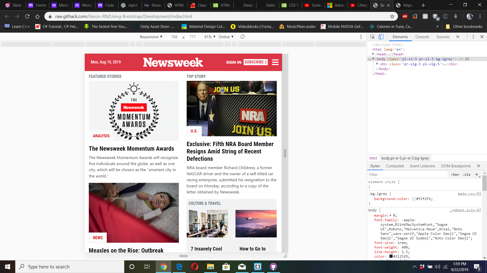
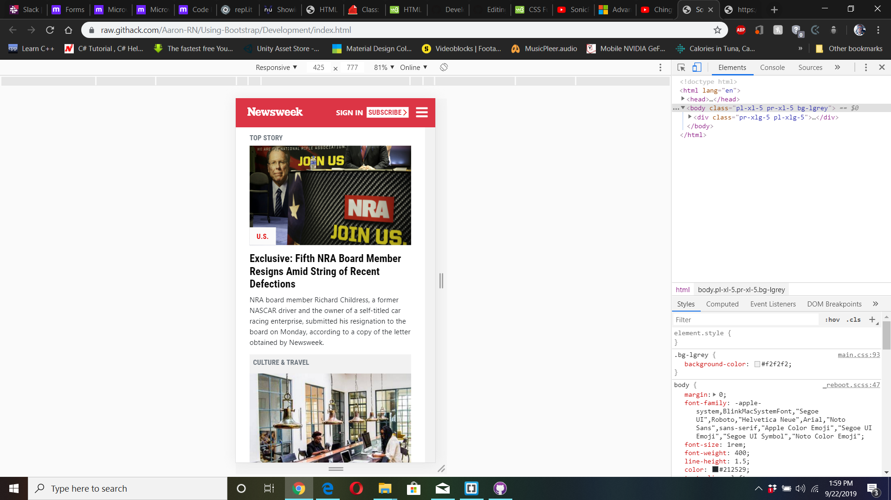

# Using-Bootstrap
### Project Description
A solo project where I am tasked with creating a replica of the newsweek.com website using the Bootstrap framework. You can find the original project specification at: https://www.theodinproject.com/courses/html5-and-css3/lessons/using-bootstrap

### [Live Demo Link](https://raw.githack.com/Aaron-RN/Using-Bootstrap/master/index.html)

## Built With

- HTML5, CSS

## Author

👤 **Aaron Rory**

- Github: [@Aaron-RN](https://github.com/Aaron-RN)
- Twitter: [@ARNewbold](https://twitter.com/ARNewbold)
- Linkedin: [Aaron Newbold](https://www.linkedin.com/in/aaron-newbold-1b9233187/)

## 🤝 Contributing

Contributions, issues and feature requests are welcome!

Feel free to check the [issues page](issues/).

## Show your support

Give a ⭐️ if you like this project!

## 📝 License

This project is [MIT](lic.url) licensed.
