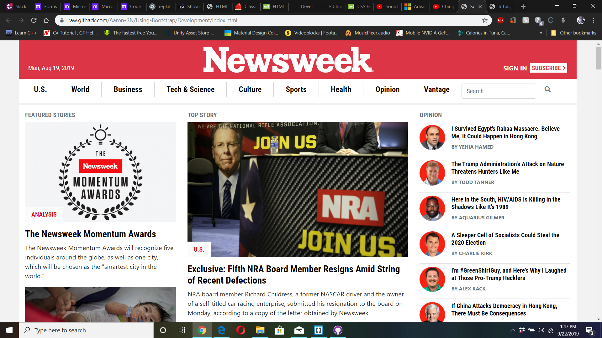

# Using-Bootstrap
A solo project where I am tasked with creating a replica of the newsweek.com website using the Bootstrap framework

# (- PROJECT: Using Bootstrap - )
A solo project where I am tasked with creating a replica of the newsweek.com website using the Bootstrap framework. You can find the original project specification at: https://www.theodinproject.com/courses/html5-and-css3/lessons/using-bootstrap

## Authors: 
### Aaron
Aaron's Github Profile: https://github.com/Aaron-RN

## Github Link
Github Link: https://github.com/Aaron-RN/Using-Bootstrap

## Live Link
https://raw.githack.com/Aaron-RN/Using-Bootstrap/Development/index.html
https://raw.githack.com/Aaron-RN/Using-Bootstrap/master/index.html

